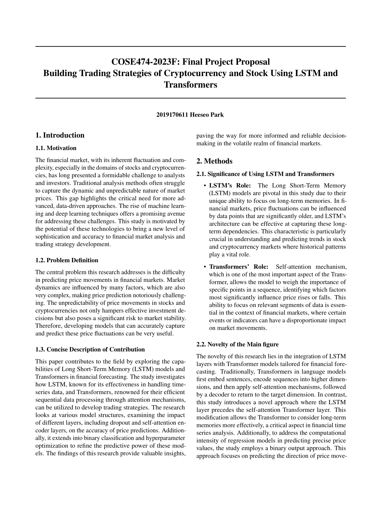
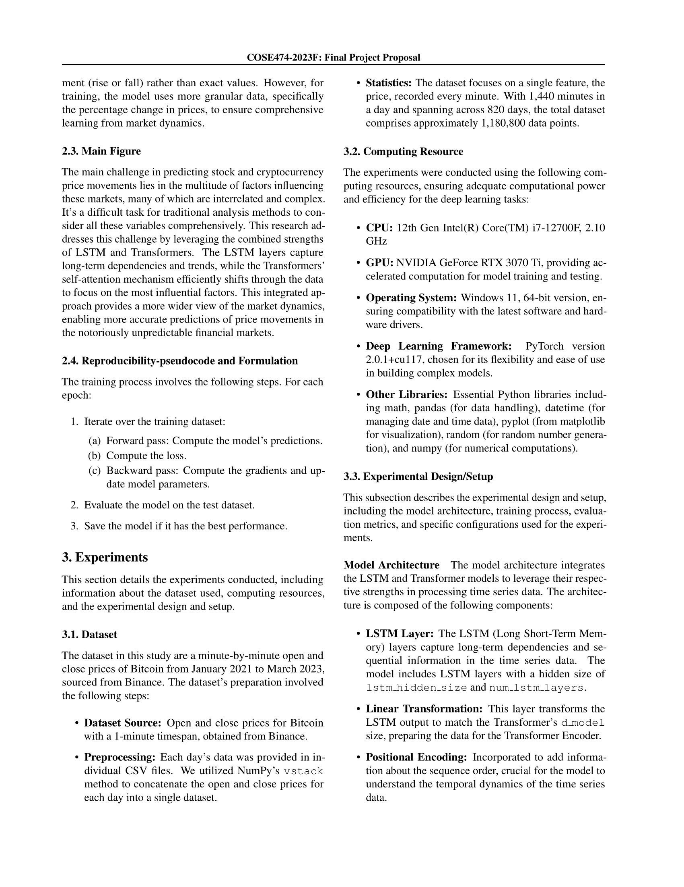
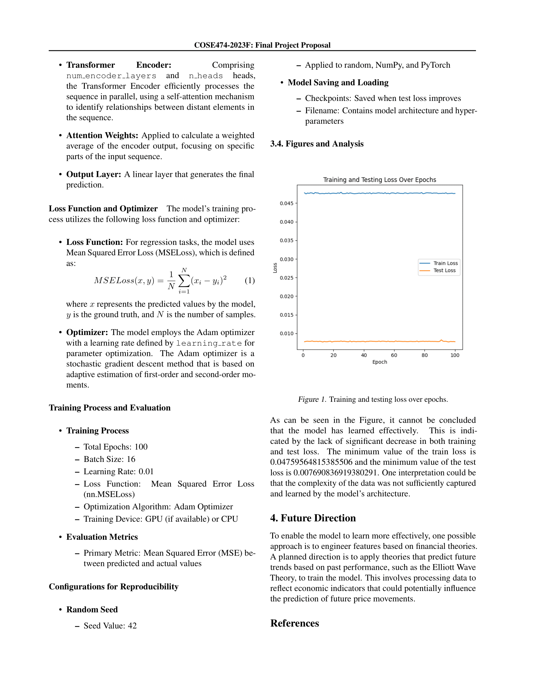

## 프로젝트 개요
주식, 암호화폐의 기존 데이터를 토대로 **미래 가격 상승/하락을 예측하는 모델**을 제작하는 프로젝트

고려대학교 NLP, DL 수업 프로젝트

- 프로젝트 기간: `23.05` ~ `23.12`
- 프로젝트 기술: `Pytorch`

## **핵심 기능**
- **시계열 데이터**에서 장기 의존성을 포착하는 데 유용한 `LSTM`과 self attention 메커니즘을 통해 데이터의 중요한 부분에 초점을 맞추는 `Transformers`를 활용하여 **주식 및 암호화폐 시장의 가격 변동을 예측**하는 모델 제작
- 21년 3월부터 23년 11월까지의 **1분봉 데이터셋**을 사용
- **100분간의 데이터**를 통해 미래 **10분 동안의 상승/하락을 예측**하는 모델
- 결과의 복잡성을 줄이기 위해 **100개의 상승/하락 비율**을 입력할 때, **10개의 상승/하락 여부를 이진값**으로 나타내는 모델 구현

## **도전 과제 및 해결책**
- 전통적으로 `Transformers`는 언어 모델에 주로 사용되었으나, 이 프로젝트에서는 금융 예측에 맞게 _LSTM 계층_과 결합하여 새로운 접근 방식을 모색
- 딥러닝 데이터의 복잡한 패턴을 학습하고 예측하는 과정을 깊이 이해
- `LSTM`과 `Transformers`를 직접 적용하여 시계열 데이터에서 중요한 정보를 추출하고, 이를 바탕으로 미래의 가격 변동을 예측하는 과정에서 딥러닝 모델의 학습 및 최적화 방법에 대해 경험
- 더 나아가 딥러닝에서 사용하는 모델을 만들기 위한 **데이터셋 생성, 데이터 전처리, 학습 및 평가**의 단계를 경해보는 시간을 가짐
- _Neural Network 설정, hyperparameter 설정_ 등 모델의 성능을 위한 **파인 튜닝** 과정의 필요성 이해

## **프로젝트 확장 가능성**
- 엘리어트 파동 이론과 같은 금융 이론을 접목하여 **복잡한 금융 데이터 분석 능력을 강화**할 수 있을 것
- AI 기반 가격 예측 모델을 **실제 거래에 적용**하거나 사용자에게 예측 결과를 제공하는 방안을 모색할 수 있음

## 프로젝트 보고서

